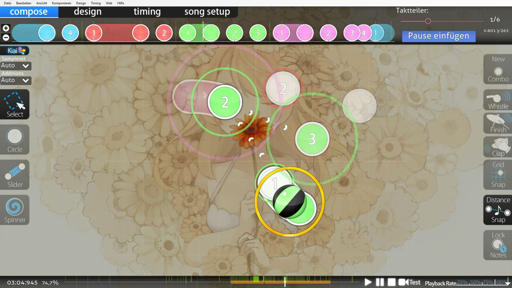

# Beatmap-Editor

*Für Kürzel im Beatmap-Editor, siehe: [Tastenkürzel § Beatmap-Editor](/wiki/Client/Keyboard_shortcuts#beatmap-editor)*

Der **Beatmap-Editor** ist die graphische Benutzeroberfläche in osu!, mit der [Beatmaps](/wiki/Beatmap) erstellt werden. Das Erstellen von Beatmaps für osu! nennt sich [Beatmapping](/wiki/Beatmapping).

Der Beatmap-Editor ist in vier Hauptabschnitte eingeteilt, die in der linken oberen Ecke zu sehen sind:

- Compose
- Design
- Timing
- Song-Setup

## Compose

Im Tab [Compose](/wiki/Client/Beatmap_editor/Compose) lassen sich alle [Hit-Objekte](/wiki/Gameplay/Hit_object) und andere Gameplay-bezogene Elemente erstellen. Viele Mapper verbringen infolgedessen die meiste ihrer Zeit in diesem Bereich.

## Design

Der Tab [Design](/wiki/Client/Beatmap_editor/Design) bietet eine Möglichkeit zur Erstellung von [Storyboards](/wiki/Storyboard), den visuellen Effekten, die Beatmaps begleiten. Da Storyboards oft komplexe Effekte haben, die die Verwendung von vielen Storyboard-Befehlen voraussetzen, benutzen Mapper auch [Storyboard-Scripting](/wiki/Storyboard/Scripting) direkt, ohne den Design-Tab aufzurufen.

## Timing

[Timing](/wiki/Client/Beatmap_editor/Timing) verwaltet Timing-Sektionen eines Songs und steuert die Hitsounds einer Beatmap. Dies ist unerlässlich, da eine Beatmap korrektes Timing und angemessenes Feedback braucht, um das Spielerlebnis an den Rhythmus eines Songs anzupassen.

## Song-Setup

Mit [Song-Setup](/wiki/Client/Beatmap_editor/Song_setup) lassen sich die [Metadaten](/wiki/Client/Beatmap_editor/Song_setup#song-and-map-metadata) einer [Beatmap](/wiki/Beatmap) und andere Dinge, die für eine Beatmap einzigartig sind, eintragen. Das beinhaltet den Titel eines Songs, den Künstler, den Namen des Schwierigkeitsgrads, Combo-Farben, etc.

## Anderes

Andere Komponenten des Beatmap-Editors beinhalten:

- [AiMod](AiMod): Ein automatisiertes System, welches Probleme in einer Beatmap meldet
- [Taktteiler](Beat_Snap_Divisor): Bestimmt, wie Objekte auf der Zeitleiste einrasten
- [Distance-Snap](Distance_snap): Der Multiplikator, der beeinflusst, wie nah oder weit Hit-Objekte voneinander entfernt sind
- [Kiai-Zeit](/wiki/Gameplay/Kiai_time): Spezielle Timing-Sektionen, die helfen, Teile einer Beatmap hervorzuheben
- [Menü](Menu): Hilft dir bei der Orientierung im Beatmap-Editor
- [SB-Belastung](SB_Load): Eine Zahl, die angibt, wie anspruchsvoll ein Storyboard ist
- [Zeitleisten](Timelines): Zeigt die platzierten Hit-Objekte, Pausen und mehr an
