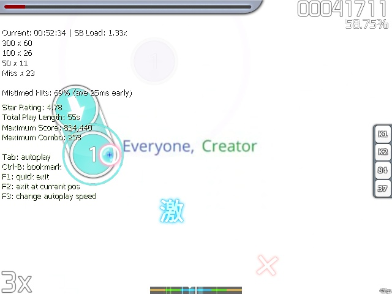

<!-- TODO: some outdated info and this could be simplified a lot. it's a pretty long read for what you get -->

# 如何测定歌曲时间轴 (Timing)

## 序言

测定歌曲的时间轴并非难事，不需要灵敏的耳朵和大量游玩音乐节奏游戏的经验，只需要一点基础乐感和灵活的思维，就可以开始测定了。但若拥有前面两项能力，就能如虎添翼，测定出一个准确合适的时间轴。

测定前，你需要先弄清楚[每分钟节拍数 (BPM)](/wiki/Music_theory/Tempo) 和[偏移值 (offset)](/wiki/Offset) 的含义，以及设置红线（非继承时间点）的方法。

## 准备 .mp3 文件

如果你想上架谱面，那么请使用比特率处于 128 到 192 kbps 之间的歌曲文件（这确保了歌曲质量适中，也不会占据太多本地或云端的磁盘空间）。你可以通过右键歌曲文件，点击属性-详细信息来得知文件的比特率。如果你不知道如何压制文件降低比特率，请参见[音频编辑](/wiki/Guides/Audio_editing)和[这个官方教学视频（跳转到 YouTube）](https://www.youtube.com/watch?v=muu3HkG38kk)。当然，你也可以寻求朋友的帮助。若以上都行不通，请在这个[论坛](https://osu.ppy.sh/community/forums/56)上寻求帮助。或者你可以试着自己慢慢上手。

最好在**测定阶段前**的准备阶段内就完成歌曲的裁切、润色工作。因为**任何**音频文件的编辑、重编码，都会*改变时间轴*。

## 单红线测定

### 目的与目标

几乎所有歌都有它固定的节奏，就如同歌曲的“骨架”一样。这是整首歌曲的基础。乐器或人声都是基于这个“骨架”来演奏或歌唱的。每首歌曲都有自己的节奏结构，而我们的测定任务即是利用游戏的红线来复现演绎这种结构。

你可以试着沉浸在歌曲中，并想象出歌曲的结构。在想象时，可以参考常见的节拍细分（4/4 拍）。歌曲的结构确定了物件所在的位置，而物件间的距离由歌曲的 BPM 决定（更高的 BPM 代表一拍或一小节的时间更短）。这也能在编辑器上部的可视化时间轴看见。

第一条红线的偏移量 (offset) 即歌曲的第一拍与 .mp3 文件头部之间相隔的时间。参见：[维基百科*节奏*](https://zh.wikipedia.org/wiki/%E8%8A%82%E5%A5%8F)。

多听歌曲，你就能找到歌曲的主体节奏，然后准确地测定出时间轴。编辑器能自动计算已对齐物件之间相隔的时间。而且在作图之前，我们只需要测定准确的 BPM 和设置准确的拍子记号。

简而言之，步骤是：

1. 测出 BPM 和 offset 的近似值。
2. 尽可能精细地调节 offset，让红线对齐歌曲的第一拍。
3. 调节 BPM。
4. 设置准确的拍子记号（4/4 拍或者 3/4 拍，但通常是 4/4）。
5. 测试谱面。如需要，重复第 2 步和第 3 步。

### 测定每分钟节拍数 (BPM) 和 偏移量 (offset)

当测定这两个值时，我们需要仔细听伴奏内规律演奏的乐器（通常是鼓）。凭你的直觉找到它————就像钟摆一样，尝试在钢琴曲内用手指均匀地敲击桌面；或是在播放迪斯科舞曲时随着歌曲摇头；或尝试做一些其他随着节奏而起的本能性的动作（如拍手）。有时歌曲会出现无伴奏的段落（比如[这张谱面](https://osu.ppy.sh/beatmapsets/8894)），此时可以跟着人声来测定时间轴。

播放歌曲并仔细聆听，直到你能清楚地分辨出歌曲的主干节奏。此时暂停，回退一段，重新播放并尽可能有节奏地按下 `T` 键（也可以用鼠标点击右上方的“戳这里！”按钮，但是用键盘测定更靠谱）。每次你按下按键后，这两个值都会参考你的输入来轻微浮动。直到趋于稳定。这个步骤通常只耗费你半分钟到一分钟的时间。

除此之外，我们强烈推荐你使用软件 Timeanalyzer 来轻松测得这两个值。

#### 测定偏移量 (offset)

按照以上的操作做完后，即可求得近似的偏移量。现在，倒回歌曲的第一拍（此时已经可以看见一条确定时间轴的红线），并将编辑器右下角的播放速率调至 75% 或更低来更精确地测定偏移量。此时只需保证右上角节拍器闪烁的频率和快慢刚好对得上歌曲即可。

播放速率调低至 50% 或更低，稍微回退一点并按空格键播放。此时歌曲会以 0.5 倍速播放，你也能更容易地分辨红线确定的节拍器和歌曲实际节拍是否存在的细微的偏移。使用偏移量左右的上下箭头来调节它。

有关箭头的小技巧：

- 鼠标点击: 2ms
- 按下 Shift 键 + 点击: 10ms
- 按下 Ctrl 键 + 点击: 1ms
  - 1,000ms（毫秒）= 1 秒

使用 25% 的播放速率，也可能导致不准确的测量结果。请反复检查，谨慎使用（当然，如果影响不大，还是建议尽量降低播放速度来精确测定）。

#### 测定每分钟节拍数 (BPM)

此时偏移量已经测好，可以开始检查 BPM 是否准确了。测出准确的偏移量能降低你测出错误 BPM 的风险。从红线开始一直播放到歌曲结束，注意听编辑器的节拍器的嘀嗒声是否仍旧贴合歌曲节拍，必要时适当调整。

- 如果 BPM 准确，那么节拍器不应该偏离于歌曲节拍。当你遇到这些情况时：
  - 如果节拍器的嘀嗒声逐渐快于歌曲，此时应降低 BPM （点击朝下的箭头）。若反之，则点击朝上的箭头。
  - 难以分辨时，降低播放速率。
- 再三检查。

有个检查的小技巧，即跳到歌曲的中间部分或结尾部分听节拍器和歌曲节拍是否有偏差。同时，BPM 通常为一个整数。所以如果当前的 BPM 测得含有 0.1 或 0.01 这样的小数，请尽量把当前的结果往整数上移动。注意：并非所有的电子音乐和合成音乐都有一个整数的 BPM，在少数早期或者 Live 版歌曲里，出现如 BPM 112.138 这样奇葩的值也是很正常的。在这种情况下，略去小数可能会导致时间轴出错。所以请根据情况判断是否应该略去小数。

### 使用 TimingAnlyzer 工具

在实际作图中，谱师常用这个小软件来大致测定**单红线歌曲**的时间轴，略去了大量冗余的操作。

#### 步骤

1. 下载软件，并粘贴到 osu! 安装的路径（或含有 bass.dll 的文件夹内）。
2. 打开软件，找到你需要近似测定的歌曲文件并打开，或是拖动歌曲文件到软件图标上即可。
3. 应用提示输入 BPM。若是首次测定，也可留空，让软件自动测定。按 `Enter` 进入下一步。
4. 应用提示输入 offset。若是首次测定，也可留空，让软件自动测定。按 `Enter` 开始测定。
5. 软件显示出结果。
   - 如果结果显示的 BPM 为整数，则可直接使用。
   - 如果结果显示的 BPM 为一个非常靠近某个整数的小数，则可尝试取整，再次重复第 3 步和第 4 步，测定更精确的 offset 和检查特殊标记。 
   - 如果结果显示的 BPM 是一个不接近某个整数的小数，根据常识判断这是作曲家故意使然还是歌曲文件本身出现了问题。
   - 如果无法显示出结果，请检查文件是否不受软件支持，或歌曲长度是否短于 10 分钟且长于 30 秒，或歌曲是否复杂到需要**多条红线**来测定时间轴。
6. 如果对结果不满意，可以多次重复以上步骤，获取合理的值并使用。

#### 特殊标记

使用工具大致测量 BPM 时，软件显示的时间轴上有可能出现一些特殊标记（`#`、`+`、`-`、`.`），代表了软件探测到了单红线可能无法处理的时间轴段落。

- `#` 代表了这一段 BPM 和 offset 与软件给出的结果完全不一样。
- `+` 或 `-` 代表了这一段的 offset 和其他段落可能有细微出入，但 BPM 大致相同。
- `.` 代表了这一段 BPM 和 offset 与软件给出的结果有微小的差别。

若以上的标记仅仅出现一两个，则可以尝试忽略。但如果标记大量出现，则需要更细致的时间轴测定或是使用多条红线测定。

### 设置拍子记号

歌曲由许多重复的段落（小节）组成。这些重复的段落拥有相同的节奏构成方式（如动次打次）。你也可以参考[维基百科*拍子记号*](https://en.wikipedia.org/wiki/Time_signature)或者 [Alace 的讨论串](https://osu.ppy.sh/community/forums/topics/20998)获取更多信息。

首先，找到这些小节内最重的那一拍（又称为[下拍](/wiki/Music_theory/Downbeat)）。下拍附近的鼓点通常都会很重，歌手也会唱得卖力些。第一个下拍通常和第一条红线重合。若不是，则需要移动 offset 来对齐。osu! 首页的脉冲特效、kiai 闪烁方式、NC Mods 附加音效的正常工作都需要谱面的红线完全对齐下拍。

然后我们即可设置拍子记号了。此时。编辑器右上的节拍器最左边的方框总会在下拍的位置闪烁。如果不是，则需调整。

编辑器内有这几种基础拍子记号：

- **4/4** 又称为四四拍（强弱弱弱）。有时也称为常规拍子（因为多数歌都使用它）。
- **3/4** 又称为四三拍（强弱弱）。有时也称为华尔兹拍子。
- **\#/4** （\# 可为任何正整数）又称为“奇异拍子”。这种拍子记号*非常特殊*而且很少用于普通的歌曲。请谨慎使用这种拍子记号，除非歌曲支持而且你有足够的乐理知识作参考。

### 测试

在测试阶段，我们需要在谱面内放入少量物件并尝试点击它们。

- 测试用的物件最好不要放在歌曲最前的位置，并提前放置几个滑条引导玩家。
- 物件放在 1/1 的白线上，尽量不要放置更复杂的节奏。

作完图后，可以按下 `F5` 按键进入测试模式，能帮助谱师快速测试谱面。测试模式能显示玩家按下的时机与谱面完美时机的差值。如果谱面通过了测试，你就可以继续之后的步骤。如果有问题，也可以在 \#mapping 频道或其他地方寻求测定时间轴或者试图之类的帮助。

以下是一些提示：

- 如果你在开头的几个物件拿到了不完美评价（低于 300），马上停止测试，并检查是否有其他错误。
- 偏差值会随着测试进行逐渐变得平缓。所以最好每隔半分钟按 `F2` 停止测试，然后按 `F5` 继续测试。
- 给测试用的物件下拍手音效能辅助测试（与 DDR 的“练习模式”近似）。

请在持续击打出完美评价的同时注意左上角的测试窗口。其中有一行文字显示为：**Mistimed Hits: 69% (ave 25ms early).**

- 第一个百分比表示了不完美击打的比例。
  - 请务必将此值降低到 5% 以下。
    - 100 和 50 评价会提高这个比例，300 会降低比例，Miss 不统计到其中。
- 第二个值代表了测试击打偏差的平均值。
  - Early 或 Late 表示测试时玩家击打时机比谱面完美时机总体来说偏早或偏晚。
    - 请尽可能降低此值（不超过 3 到 5 ms）。
  - 测试不理想时，请检查并修正时间轴。
    - 对于 Early 或 Late，仅需根据数字，相对应地调节 offset 即可。

在调节 offset 之前，需要勾选“更改 offset / BPM 时，自动把已经放好的物件对齐时间轴刻度”选项。否则，测试用的谱面物件仍会对齐在改动之前的时间轴上。在几轮测试完成后，平均偏差读数稳定在约 5ms 以下就说明时间轴已经对准了。

最后，检查你的谱面开头和结尾。如果均对齐，且在测试模式里不完美击打的比例低于 5%，则说明时间轴已经测量好了。除此之外，你可能需要其他玩家复查谱面时间轴，特别是如果你对部分时间轴的精度不太确定，那么更需要其他人的复查。

## 多红线测定

### 序言

有时候，一根红线不足以反映出歌曲时间轴的全貌（如这些谱面：[Bad Apple](https://osu.ppy.sh/beatmapsets/64780)、[DJ Amuro's A](https://osu.ppy.sh/beatmapsets/20841)、[kemu's Ikasama Life Game](https://osu.ppy.sh/beatmapsets/183240)）。硬摇滚 (Hard Rock)、金属乐、吉他弹唱、音乐会、现场演奏歌曲，或是歌曲加速，减速和休止等等都可能含有比较复杂的时间轴。即使全歌大部分都贴合在单一红线的时间轴上，部分片段（高潮段或结尾段）也可能不会贴合到时间轴上。歌手歌唱、乐器演奏时都带有一定的随机性。简单地调节歌曲第一条红线可能不会起什么作用。

你可以请求擅长测定复杂时间轴玩家的帮助。但是这类玩家基数很小。更多地，如果你对你的谱面投入很少，谱面难以过审上架或是他们觉得不值得投入太多精力，他们可能不愿意帮助你。如果你拥有足够的打图经验，打图准确率很高，你可以自己尝试着去测量。此时，在打图方面拥有高准确率很重要，因为如果你的打图准确率不高，多次测试得出的时间轴往往与实际相差甚远，最后完成的谱面也大概率会误导玩家。

### 我该怎么做？

首先，尝试反复聆听并找出歌曲内所有可能的 BPM 变化的位置（可以尝试使用节拍器），在合适时即可添加额外的红线来修正段落的 BPM 和 offset。你可以尝试以下的方案：

1. 确保当前段落的 BPM 和 offset 已经大约测定好。
2. 尽可能将 osu! 的帧率调至最高（使用 optimal 或无限制选项，而不是 power saving）。低帧率下，25% 播放速率可能会带来不必要的延迟从而影响时间轴测定。
3. 按下空格，以较低的播放速率播放歌曲。当听到某一拍与编辑器内的节拍器嘀嗒声明显错位时，停止。往回倒一段时间（一拍以上即可），重新播放。找出刚开始错位的那一拍。
4. 在错位拍前和之前红线准确贴合的这一拍插入一根红线，根据错位的类型（歌曲节拍先于编辑器节拍器嘀嗒声或是后于嘀嗒声）微调红线的参数 （BPM 和 offset），再次重放这一段，确保红线之后的一拍刚好和之前错位的节拍对齐。
5. 重复第 3 步和第 4 步，直至整首歌曲测定完毕或是与其后稳定 BPM 的段落相接。
6. 进入测试模式测试谱面，找出偏移明显变化的段落，修正后继续检查。

以上过程枯燥乏味，可能要花费数小时甚至几天的时间来完成。但请不要气馁，你所付出的努力终有一天能得到回应。

### 注意事项

- **常备份你的谱面。** 如果对测定结果不满意，你也能够快速地恢复之前的草案。
- **常测试你的谱面。** 你可以请求他人测试，或是自己测试然后观看回放。注意击打偏差明显变化的地方，并考虑是否进一步细化测定这个地方的时间轴。
- **所有用于复杂时间轴测定的红线最好按照歌曲节拍细分对齐到歌曲内相应的位置。** 这有利于重置节拍，或是保留歌曲的结构印象。推荐使用 1/1、1/2、1/4 节拍细分来贴合直拍 (Straight Beat) 结构的歌曲，使用 1/1、1/3、1/6 节拍细分来贴合摇摆拍 (Swing Beat) 结构的歌曲。如果歌曲的节拍类型在特定位置与以上推荐有所不同，则应优先根据歌曲实际情况来添加红线。
- **所有用于复杂时间轴测定的红线不能随意更改拍子记号。** 拍子记号是由歌曲决定的。即使某些红线控制的时值不足一小节（四拍），也不应为了“对齐前后红线的大白线位置”而去更改它。
- **应尽量简化你的时间轴。** 复杂时间轴的红线应以 1/1 频率为主。在音符较少的段落，可以按照 4/1 拍或 2/1 拍的频率添加红线。比 1/8 拍密集的红线通常是没有必要的。而且，即使密集的红线精准地对应上歌曲内每一个音符，玩家也可能因为复杂的 BPM 而很难取得完美的成绩。你也可以参考[这个视频（跳转到 YouTube）](https://youtu.be/nUHEPmg0sPo)来理解为什么不要过于细化时间轴。
- **如果歌曲的复杂时间轴段落之后为一段稳定 BPM 的段落，则应添加一条用于重置节拍的红线。** 重置红线应加在[下拍](/wiki/Music_theory/Downbeat)的位置。这能使主页面脉冲特效恢复运作，也能为摆放物件或添加音效提供参考。
- **如果可以，务必请他人检查时间轴。** 不同人对节奏或重拍的感受不一。参考他们的方案或建议来修改时间轴，找到一个被大多数人接受的方案，能提升玩家的游戏体验。
- **若谱面完成度较高，请在复杂时间轴测定或修正时间轴之前关闭“更改 offset / BPM 时，自动把已经放好的物件对齐时间轴刻度”功能。** 这个功能常常会造成大范围的偏移错误，在复杂时间轴谱面内尤甚。
- **请在完成时间轴测定后，把谱面的所有物件重新对齐。** 若歌曲只有 1/1、1/2、1/3、1/4、1/6 或是 1/1、1/2、1/4、1/8 节奏，即可把节拍细分拉到 1/12 或是 1/16，同时使用编辑器自带的“重新对齐所有物件”功能。如果包含了更复杂的节奏（特别是 osu!mania 谱面），请在使用功能后手动对齐这些按照不受支持节拍细分放置的物件。
- **若歌曲时间轴变化单一，或是歌曲前后都贴合某条红线确定的时间轴，但歌曲中间含有复杂变化的段落时，请尽量从后往前测定时间轴。** 这能有效消除由于 osu! 独特的向下取整机制而导致的 1ms 误差累积。
- **请时常休息一下。** 测定复杂时间轴是一件很苦的工作。请不要累着自己。如果感到身体不适，请立即关闭游戏，必要时询问医生。

## 结语

你只应该在这些情况下才能帮助别人测定时间轴：

- 你在测定复杂时间轴这一方面有充足的经验。
- 谱面时间轴出现严重明显的错误（比如你测得 175 BPM 而谱面设为 170 BPM）。
- 你需要知道自己在做什么。若你不能保证帮助修正后的结果更加准确，或可能对谱面上架没有帮助时，请不要急着去帮助他人测定。

以上就是关于如何测定歌曲时间轴的所有内容了。它可能不面面俱到，但请注意，测定时间轴并不是一件易事，请多积累经验或者多寻求帮助。
